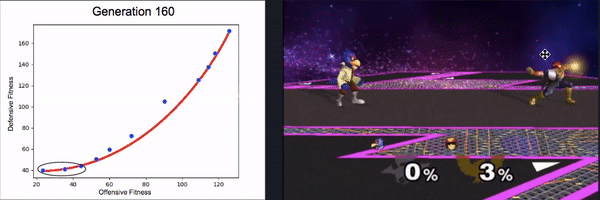
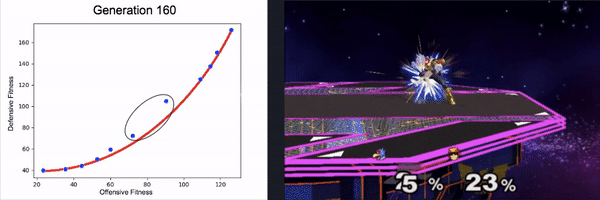
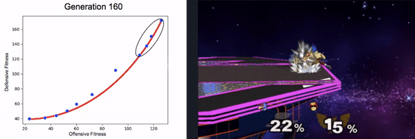

# Melee Fighting AI
We used NSGA-II in DEAP to optimize a set of Smash Bros AI agents for both offensive and defensive objctives. By optimizing for two objectives with NSGA-II, we are able to evolve a diverse set of agents that implement varying degrees of offensive and defensive strategies.

## Requirements
Tested on: Ubuntu 14.04 LTS & macOS Sierra, Dolphin 5.0

1. [Current stable version of Dolphin](https://wiki.dolphin-emu.org/index.php?title=Building_Dolphin_on_Linux#14.04_LTS)
2. Super Smash Bros. Melee (NTSC 1.02) iso
3. Python 3
4. Python packages: [DEAP](https://github.com/DEAP/deap#installation), numpy

## Run
Pull the repo and run with `python3 -m p3` before opening Dolphin. Stop with ^C.

## Report
My final report over this project can be found [here](https://github.com/FRI-GAMEAI/NSGA-Smash-AI/blob/master/final%20report.pdf)

## Credits
Thanks to https://github.com/spxtr/p3 for the memory watcher, as well as to https://github.com/luckycharms14/MeleeAI_Dolphin for help with setting up Dolphin pipe configuration. Inspiration for this project comes from https://github.com/vladfi1/phillip
